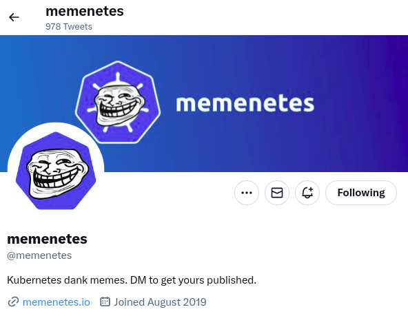
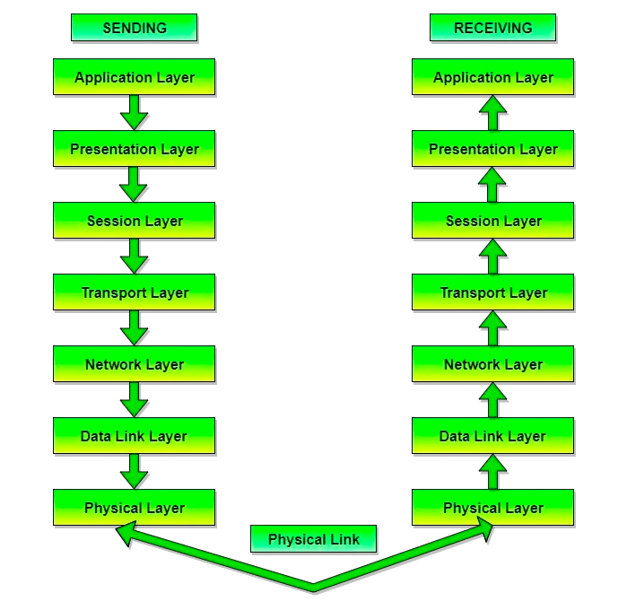
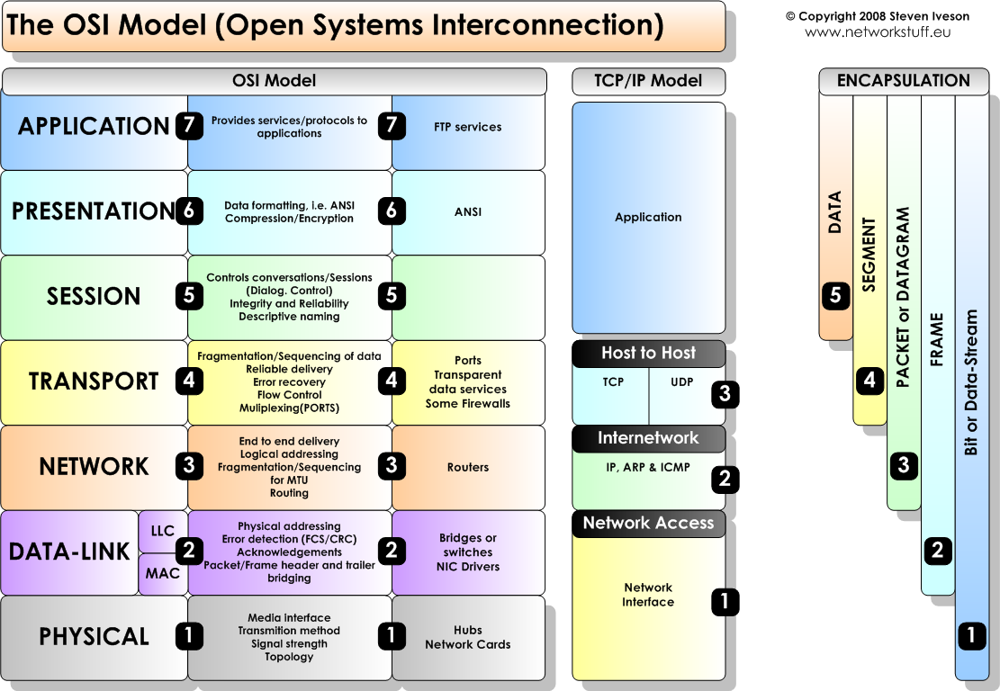
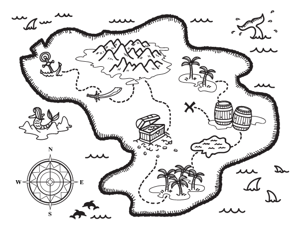
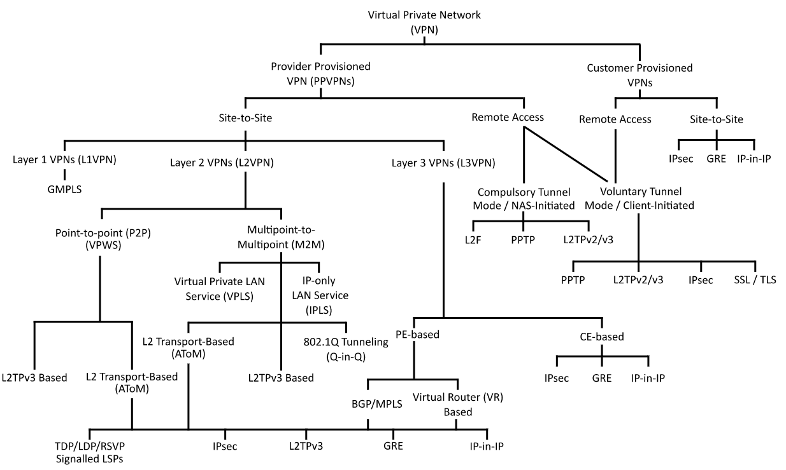

- github.com/pwright/skupper-preso
  
- Acknowlegements
  
- Maps
  
  provide a way to visualise the world, not graphs
  
  .png)
	- OSI Model
	  
	- TCP/IP model
	  
	- Treasure map
	  
	- North South vs East West
	  
	  
	  * Currently defined wrt 'Data centers'
	  
	  * East-West traffic is used internally
	  eg monitoring 
	  
	  * North-South traffic is used externally
	  eg website
		- What do we do to secure North South traffic:
		  
		  * DNS to provide a simple name
		  * TLS to protect traffic
- Reality of networking today
  
  * Kubernetes to scale
  * Use VPNs for connectivity
- VPNs
  
- Kubernetes
  
  .png)
	- .png)
	- .png)
	- .png)
	- .png)
	- .png)
	- .png)
	- .png)
	- .png)
	- .png)
	- .png)
	- .png)
	- .png)
	- .png){:height 406, :width 325}
- Maybe we can fix all this
  .png)
	- Scenario
	  
	  
	  Pug based companies merge:
	  
	  * Pug Nation
	  * Pug